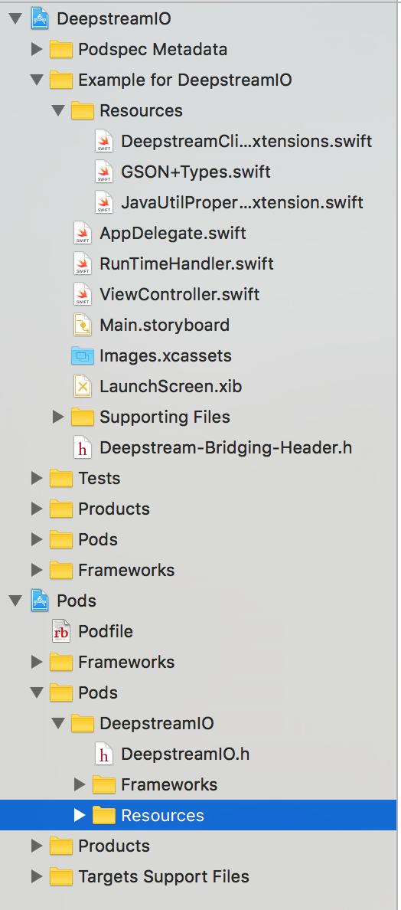
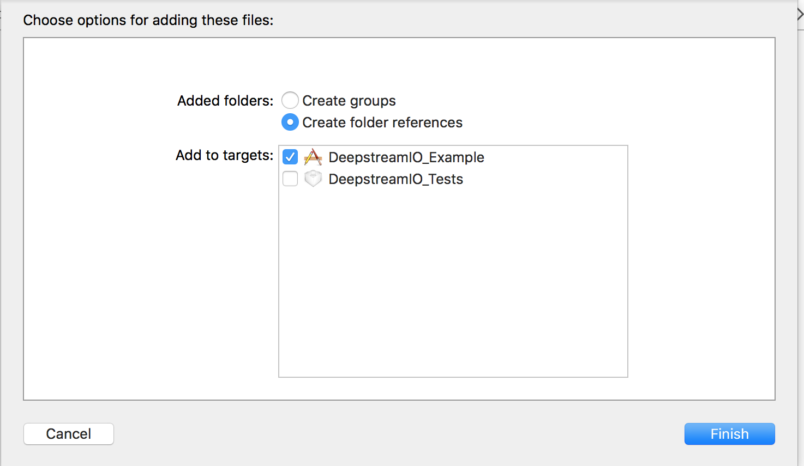

# DeepstreamIO

[](https://travis-ci.org/Akram Hussein/DeepstreamIO)
[](http://cocoapods.org/pods/DeepstreamIO)
[](http://cocoapods.org/pods/DeepstreamIO)
[](http://cocoapods.org/pods/DeepstreamIO)

## Example

To run the example project, clone the repo, and run `pod install` from the Example directory first.

## Requirements

## Installation

DeepstreamIO is available through [CocoaPods](http://cocoapods.org). To install
it, simply add the following line to your Podfile:

```ruby
pod "DeepstreamIO"
```

# Building with Swift

Be sure to add a `Bridging Header` that references `#import <DeepstreamIO/DeepstreamIO.h>` [see example](Example/DeepstreamIO/Deepstream-Bridging-Header.h)

For example, in your project:

1. Select File > New > New File...

2. Select `Header File`

3. Give it a name e.g. `Your-Project-Bridging-Header.h`

4. From the Project Navigator, select your project (blue icon)

5. Navigate to Build Settings

6. Search for `bridging header`

7. Add an entry like such, replacing the folder name and your file name
${PROJECT_DIR}/Project-Name/You-Project-Bridging-Header.h
e.g. ${PROJECT_DIR}/DeepstreamIO/Deepstream-Bridging-Header.h

An example of this is in the [Example](Example) project in the repository.

# Deepstream Extensions

To help bridge between the Java transpiled Objective-C, a Swift extension file has been provided in the Pod that can be used to simplify usage of the DeepstreamIO pod.

To add this:

1. In the newly created .xcworkspace in your directory, expand the `Pods > Pods > DeepstreamIO` tree.

2. Select the `resources` folder and drag it to your project.



3. When presented with a dialogue, make sure `Copy items if needed` is *NOT* ticked and click `Finish`.



4. You will now have access to the Swift extensions.

An example of this is in the [Example](Example) project in the repository.

## Author

Akram Hussein, akramhussein@gmail.com

## License

DeepstreamIO is available under the Apache 2.0 license. See the LICENSE file for more info.
